# iCells - Excel 增强插件

**iCells** 是一款功能强大的 VSTO (Visual Studio Tools for Office) Excel 插件，提供 200+ 实用功能，涵盖数据处理、文本提取、随机数据生成、VBA 安全工具、AI 集成等。

- **支持版本**: Excel 2013 及以上
- **运行框架**: .NET Framework 4.8
- **界面语言**: 简体中文 / English

> [**English Documentation**](README.md)

---

## 目录

- [功能演示](#功能演示)
  - [文件目录浏览](#文件目录浏览)
  - [阅读模式（聚光灯）](#阅读模式聚光灯)
  - [复制到可见单元格](#复制到可见单元格)
  - [插入序列](#插入序列)
  - [数据提取与撤销](#数据提取与撤销)
  - [汉字拼音转换](#汉字拼音转换)
  - [随机数据生成](#随机数据生成)
  - [随机抽取单元格](#随机抽取单元格)
  - [限制输入](#限制输入)
  - [显示隐藏的行和列](#显示隐藏的行和列)
  - [解除 VBA 工程密码](#解除-vba-工程密码)
  - [VBE 主题管理](#vbe-主题管理)
  - [VBA 模块显示/隐藏](#vba-模块显示隐藏)
  - [主题颜色切换](#主题颜色切换)
  - [中英文双语支持](#中英文双语支持)
- [完整功能列表](#完整功能列表)
- [交流社区](#交流社区)

---

## 功能演示

### 文件目录浏览

在 Excel 中直接浏览文件和文件夹，支持目录导航、提取文件路径和名称、批量重命名文件、根据单元格内容批量创建文件夹。

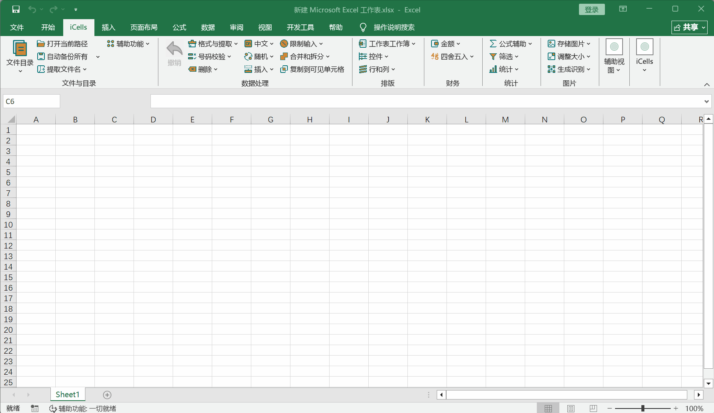

---

### 阅读模式（聚光灯）

高亮当前行/列，提供可自定义的聚光灯遮罩效果。支持透明度调节、多种配色方案、固定聚光灯模式，方便专注查看数据。

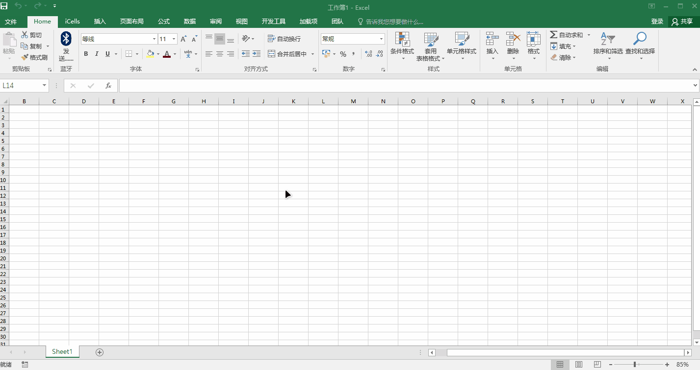

---

### 复制到可见单元格

复制数据后仅粘贴到可见（未隐藏）单元格，自动跳过筛选或隐藏的行。处理筛选数据时的必备功能。

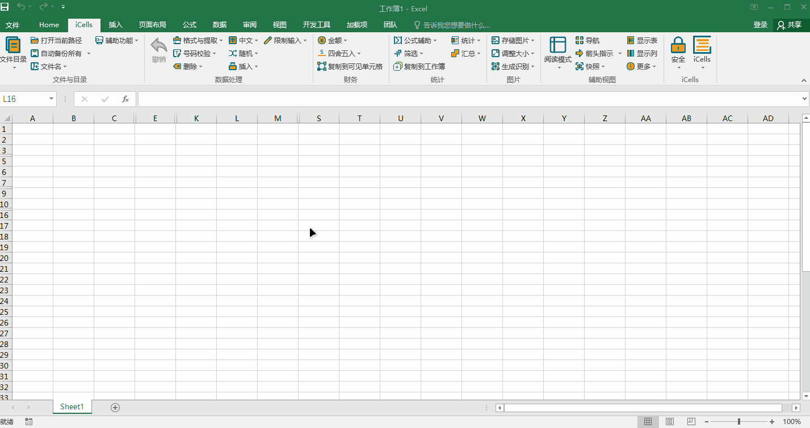

---

### 插入序列

一键插入多种序列：数字序列 (1,2,3...)、带圈数字 (①②③)、罗马数字、中文数字、天干、地支、英文字母、月份、星期等。支持撤销。

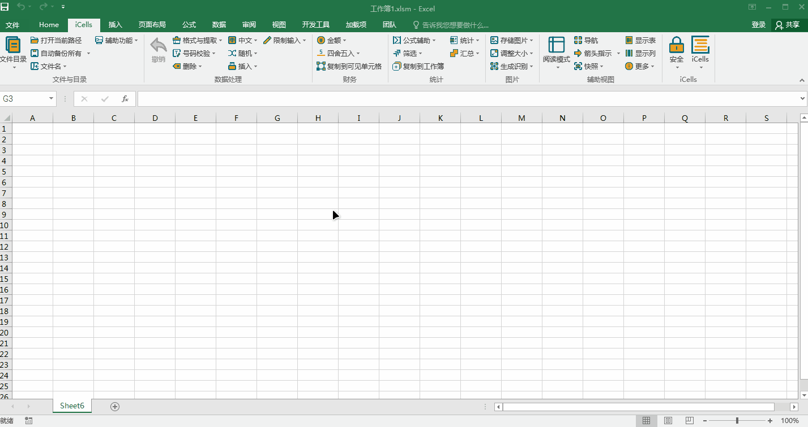

---

### 数据提取与撤销

从单元格中提取特定数据：数字、字母、汉字、手机号、邮箱、身份证号、银行卡号、邮编等。所有提取操作均支持撤销。

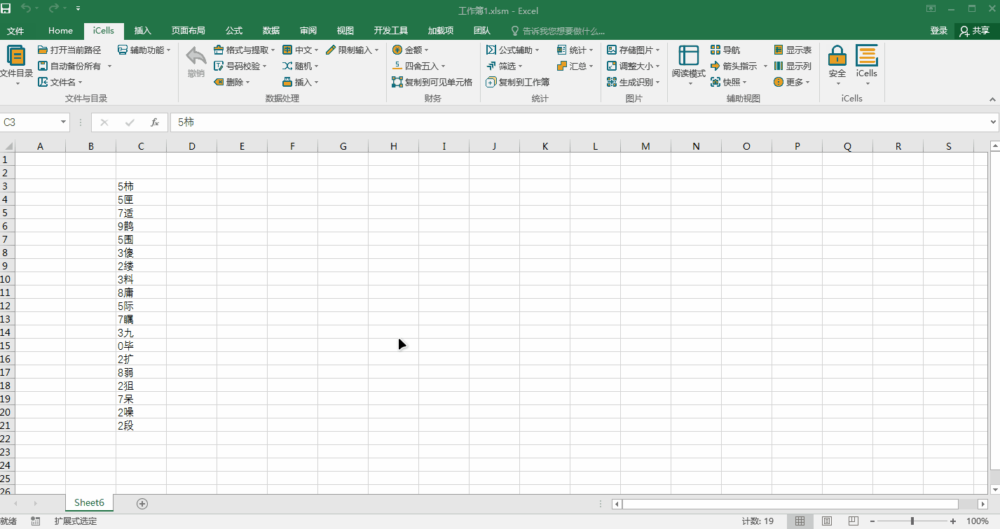

---

### 汉字拼音转换

将汉字转换为拼音、带声调拼音、拼音首字母，或获取汉字笔画数。

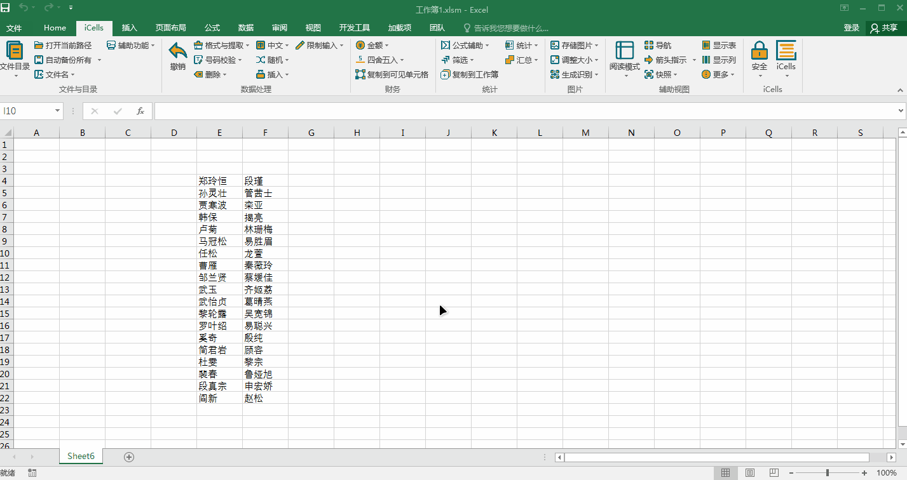

---

### 随机数据生成

生成随机整数、小数、字母、中文姓名、汉字，甚至随机数学题。支持自定义范围和精度。

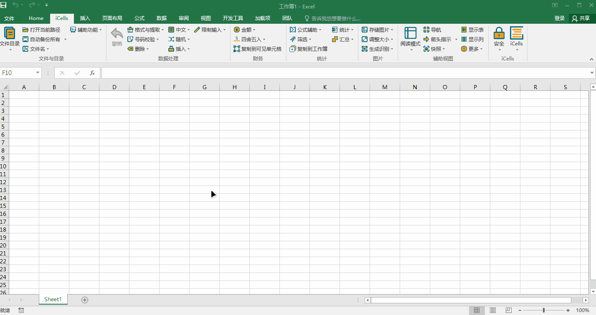

---

### 随机抽取单元格

从指定区域中随机抽取单元格，适用于随机抽样、抽奖、审计抽查等场景。

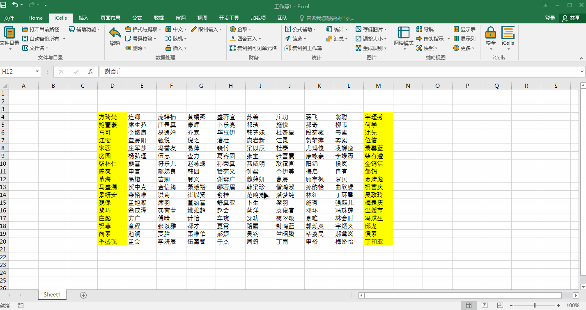

---

### 限制输入

为单元格设置数据验证规则：仅数字、仅文本、邮箱格式、手机号格式、IP 地址格式、是/否、男/女、禁止重复等。支持一键清除所有限制。

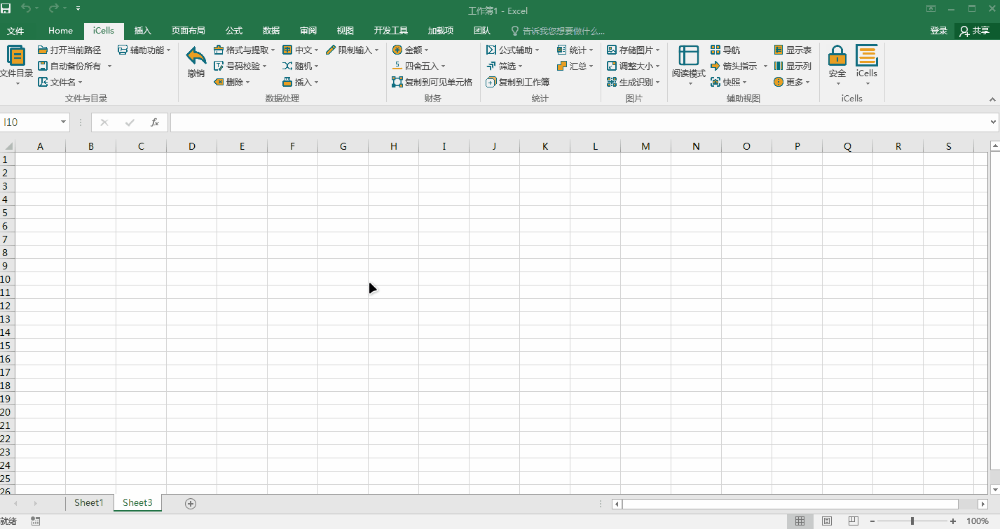

---

### 显示隐藏的行和列

快速显示/隐藏所有隐藏行和列，切换"深度隐藏"工作表，一键管理工作表可见性。

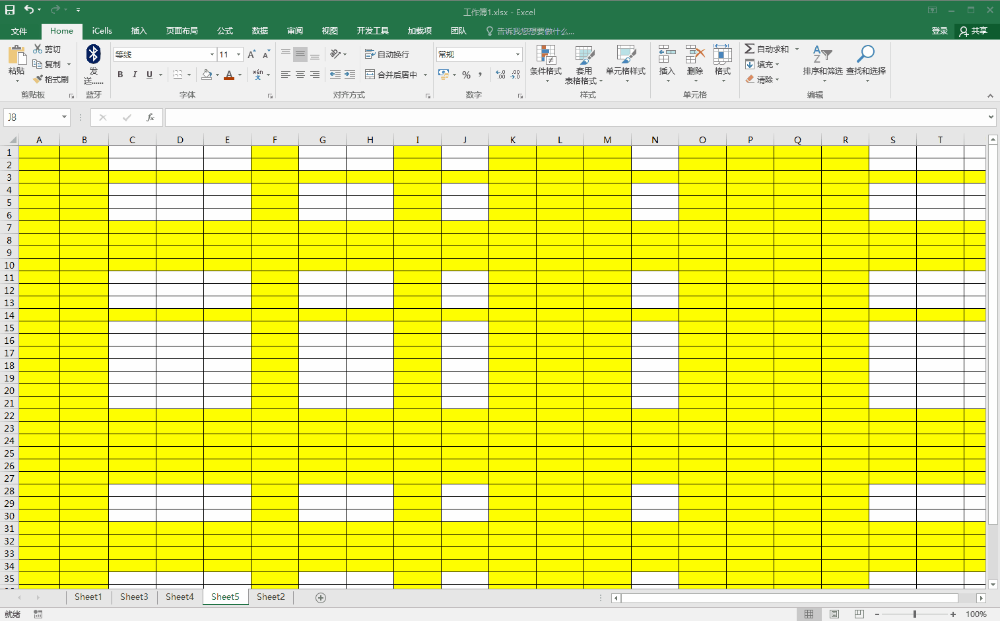

---

### 解除 VBA 工程密码

移除工作簿中的 VBA 工程密码锁定，访问受保护的 VBA 代码。同时支持设置 VBA 工程不可查看和修复可见性。

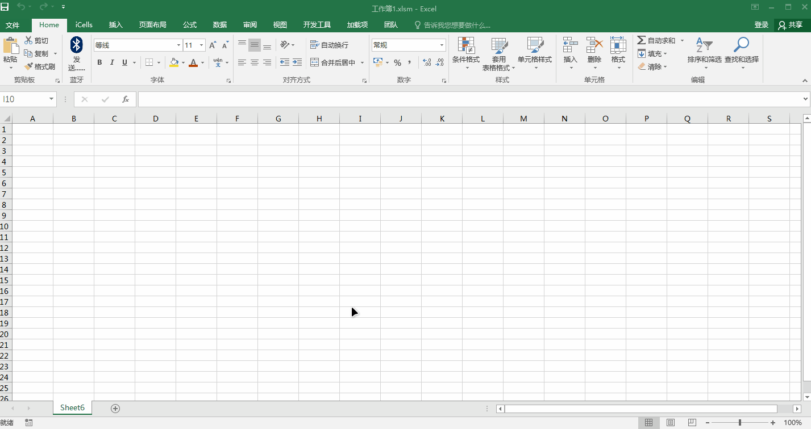

---

### VBE 主题管理

自定义 VBA 编辑器 (VBE) 的配色主题，支持深色模式、自定义语法高亮和个性化编辑器外观。

---

### VBA 模块显示/隐藏

在 VBE 工程资源管理器中显示或隐藏特定 VBA 模块，便于代码组织和项目管理。

---

### 主题颜色切换

在多种 UI 主题间切换：浅色、深色、绿色、深蓝色，或使用内置取色器创建自定义主题。

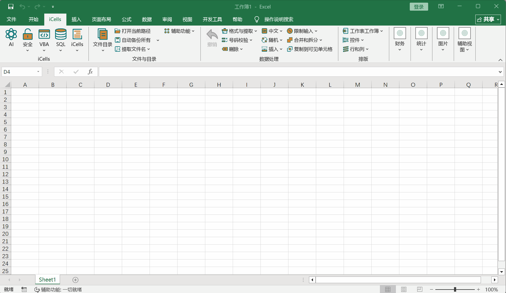

---

### 中英文双语支持

完整的中英文双语支持，所有界面元素均可动态切换语言。

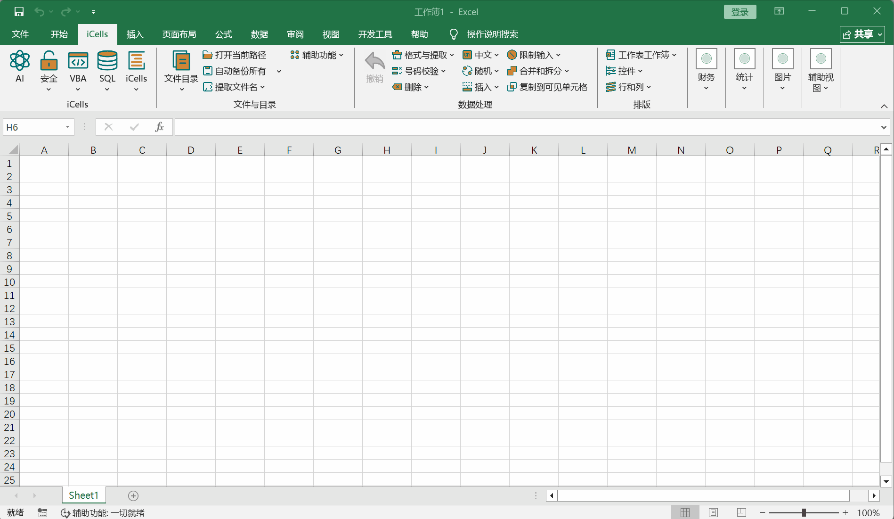

---

## 完整功能列表

### 数据处理
| 功能 | 说明 |
|------|------|
| 文本提取 | 提取数字、字母、汉字、手机号、邮箱、身份证号、银行卡号、邮编 |
| 数据格式 | 设置文本/日期格式、货币单位转换、数据反转 |
| 文本清理 | 删除空格、换行符、不可见字符、公式 |
| 合并与拆分 | 按内容合并单元格、拆分合并单元格并填充、合并工作表/工作簿 |
| 复制到可见单元格 | 仅粘贴到可见（未隐藏）单元格 |

### 号码校验
| 功能 | 说明 |
|------|------|
| 身份证号 | 校验、提取生日/年龄/性别/生肖/星座 |
| 银行卡 | 校验卡号、校验中征码 |
| 手机号 | 校验、空格/横杠格式化、隐藏中间四位 |

### 中文处理
| 功能 | 说明 |
|------|------|
| 拼音 | 全拼、带声调拼音、拼音首字母 |
| 笔画 | 获取汉字笔画数 |

### 随机数据
| 功能 | 说明 |
|------|------|
| 随机生成 | 整数、小数、字母、中文姓名、汉字、数学题 |
| 随机抽取 | 从区域中随机抽取单元格 |

### 序列与插入
| 功能 | 说明 |
|------|------|
| 序列 | 数字、带圈数字、罗马数字、中文数字、天干、地支、字母、月份、星期 |
| 特殊插入 | 下拉列表、隔行插入、特殊符号、复选框、单选按钮 |

### 限制输入
| 功能 | 说明 |
|------|------|
| 验证规则 | 仅数字、仅文本、邮箱、手机号、IP 地址、禁止重复、是/否、男/女 |

### 财务
| 功能 | 说明 |
|------|------|
| 金额 | 人民币大写、中文数字大写、万元缩写 |
| 四舍五入 | 标准四舍五入、银行家舍入、向上/向下取整、自定义小数位 |

### 图片与 PDF
| 功能 | 说明 |
|------|------|
| 导出 | 选区保存为图片/PDF |
| 图片工具 | 压缩图片、适应单元格、调整为标准证件照尺寸 |
| PDF 工具 | 图片转 PDF、合并 PDF、提取 PDF 中的图片 |
| 二维码 | 生成二维码（含/不含 Logo）、条形码、识别二维码 |
| OCR | 图片文字识别与提取 |

### 辅助视图
| 功能 | 说明 |
|------|------|
| 聚光灯 | 阅读模式，可调颜色和透明度 |
| 箭头指示 | 箭头高亮覆盖 |
| 导航 | 导航窗格、显示/隐藏工作表、显示鼠标位置 |
| 快照 | 保存和恢复工作表视图 |

### 安全
| 功能 | 说明 |
|------|------|
| 保护 | 移除工作表/工作簿保护（单个或批量） |
| VBA 工具 | 解除 VBA 密码、隐藏/显示模块、VBE 主题 |
| 隐私 | 清除文档属性和隐私信息 |

### 数据库与 SQL
| 功能 | 说明 |
|------|------|
| ACE/SQL | 执行 SQL 查询、批量 SQL、跨数据库操作 |
| SQLite | SQLite 查询、批量执行、跨数据库支持 |

### AI 集成
| 功能 | 说明 |
|------|------|
| AI 对话 | 内置 AI 对话面板，支持多家 AI 服务商 |
| 服务商 | OpenAI、Claude、Gemini、DeepSeek、通义千问、智谱、SiliconFlow、Ollama、ONNX、自定义 |
| 代码执行 | 在 Excel 中直接运行 VB.NET、VBA、C# 代码 |

### 文件与目录
| 功能 | 说明 |
|------|------|
| 文件浏览 | 目录导航、提取文件路径/名称 |
| 批量操作 | 批量重命名文件/文件夹、批量创建文件夹 |
| 自动备份 | 可配置的自动工作簿备份 |

### 界面与本地化
| 功能 | 说明 |
|------|------|
| 主题 | 浅色、深色、绿色、深蓝色、自定义 |
| 语言 | 简体中文、English |

---

## 交流社区

欢迎加入 iCells QQ 交流群，反馈问题、交流使用心得：

**QQ 群号: 17576056**

  

---

## 许可

Copyright &copy; 2020-2025 iCells Developer. All rights reserved.
